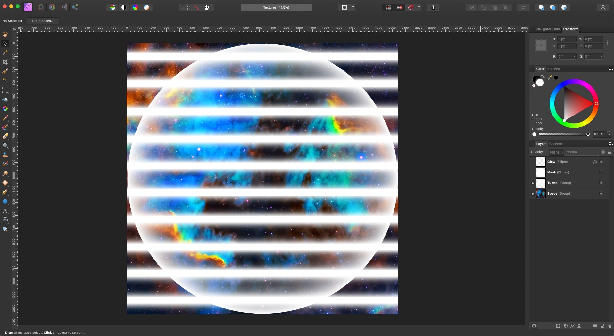
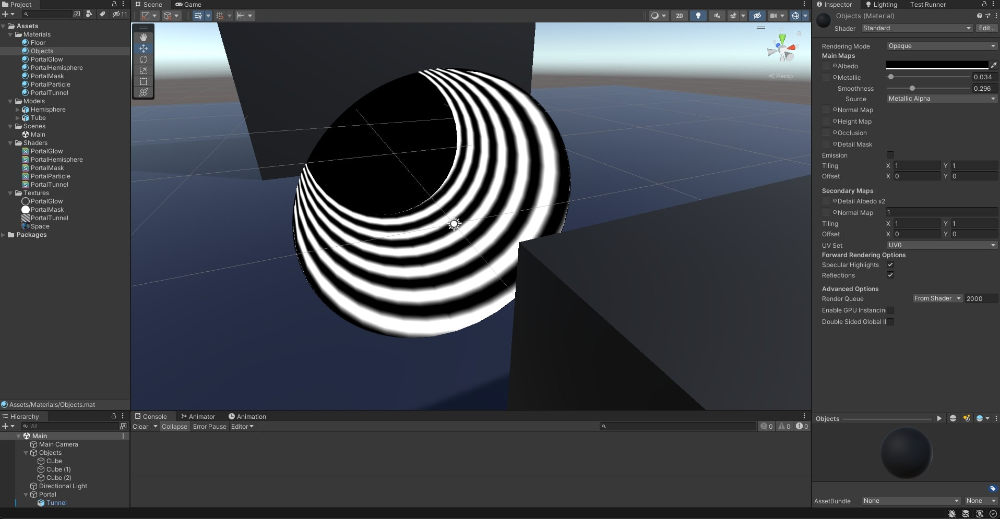

# Space Portal Shader

Using **Stencil Buffer**, **AlphaToMask** and **Shuriken** Particle System in **Unity 2021.3.10f1**

## Screenshots

## Table of Contents

- [Implementation](#implementation)
  - [Modeling in Blender](#modeling-in-blender)
  - [Creating Textures in Affinity](#creating-textures-in-affinity)
  - [Portal Mask Shader](#portal-mask-shader)
  - [Tunnel Shader](#tunnel-shader)
  - [Hemisphere Shader](#hemisphere-shader)
  - [Glow Shader](#glow-shader)
  - [Particle System](#particle-system)
    - [Particles Shader](#particles-shader)

### References

- [Space Portal Shader tutorial by Jettelly](https://www.youtube.com/watch?v=toQIuCtk2pI)
- [Space Texture](https://unsplash.com/photos/qtRF_RxCAo0)
- [AlphaTest before writing to the Stencil Buffer](https://answers.unity.com/questions/759345/is-it-possible-to-alphatest-prior-to-writing-to-th.html)

## Implementation

### Modeling in Blender

- Model a Hemisphere and a Tunnel.
- Make sure the UVs are mapped in a cylindrical mapping for the tube, so the vortex effect can be animated across the UV.y coordinates.


### Creating Textures in Affinity

- Circle for masking the entrance to the portal.
- Gradient to make the glow inside the portal entrance.
- Stripes slightly inclined, matching in the sides, to make a helicoidal Tunnel.



### Portal Mask Shader

- Use `RenderType` `Transparent` and `Queue` `Transparent`, to be able to use the transparency in the alpha channel.
- Use `ZWrite Off` to make this truly transparent, and not write to the depth buffer, affecting other shaders.
- Use `Blend SrcAlpha OneMinusSrcAlpha` for traditional transparency.
- Make all the pixels in the shader write a custom value to the **Stencil Buffer**.
- `discard` pixels that with alpha close to zero, to prevent transparent pixels from writing to the stencil buffer.
- The **Stencil Buffer** is preferable over doing a `ZTest` approach, so other objects can get rendered in front of the portal correctly.

```c
Tags { "RenderType"="Transparent" "Queue"="Transparent" }

ZWrite Off

Blend SrcAlpha OneMinusSrcAlpha

Stencil
{
    Ref 2
    Comp Always
    Pass Replace
}
```

```c
fixed4 frag (Varyings IN) : SV_Target
{
    // sample the texture
    fixed4 col = tex2D(_MainTex, IN.uv);

    if (col.a < 0.1) discard;

    return fixed4(0, 0, 0, col.a);
}
```



### Tunnel Shader

- Use `RenderType` `Transparent` to be able to use the transparency in the alpha channel.
- Use `Queue` `Transparent+2` to make it render in front of the mask by two levels.
- `Cull Front` to only render the inner faces of the tunnel.
- Use `ZWrite Off` to make this truly transparent, and not write to the depth buffer, affecting other shaders.
- Use `Blend SrcAlpha OneMinusSrcAlpha` for traditional transparency.
- Do a `Stencil Test` against the **Stencil Buffer**, check if the value is equals to 2, which is the value set by the shader that does the mask.

```c
Tags { "RenderType"="Transparent" "Queue"="Transparent+2" }

Cull Front

ZWrite Off

Blend SrcAlpha OneMinusSrcAlpha

Stencil
{
    Ref 2
    Comp Equal
}
```


### Hemisphere Shader

### Glow Shader

### Particle Shader

#### Particles Shader
